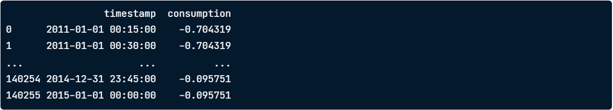
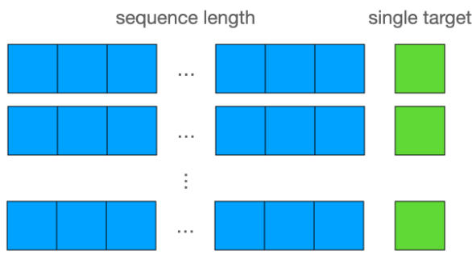
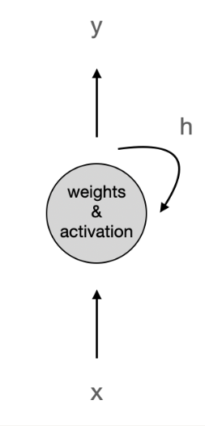
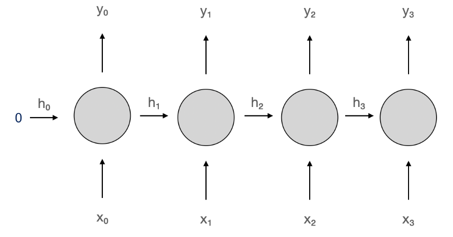

# Handling sequences with PyTorch
## Sequential data
* Ordered in time or space
* Order of the data points contains dependencies between them
* Example of sequential data:

    * Time series
    * Text
    * Audio waves

## Electricity consumption prediction
* Task: predict future electricity consumption based on past patterns
* Electricity consumption dataset:


## Train-test split
* No random splitting for time series!
* __Look-ahead bias:__ model has info about the future
* __Solution:__ split by time


## Creating sequences
* Sequence length = number of data points in one training sample

    * 24 x 4 = 96 -> consider last 24 hours
* Predict single next data point


## Creating sequences in Python
```python
import numpy as np

def create_sequences(df, seq_length):
    xs, ys = [], []
    for i in range(len(df) - seq_length):
        x = df.iloc[i:(i + seq_length), 1]
        y = df.iloc[i + seq_length, 1]
        xs.append(x)
        ys.append(y)
    return np.array(xs), np.array(ys)
```
* Take data and sequence length as inputs
* Initialize inputs and targets lists
* Iterate over data points
* Define inputs and target
* Append to pre-initialized lists
* Return inputs and targets as NumPy arrays

## TensorDataset
Create training examples
```python
X_train, y_train = create_sequences(train_data, seq_length)
print(X_train.shape, y_train.shape)
```
-> __Output:__ (34944, 96) (34944,)

Convert them to a Torch Dataset
```python
from torch.utils.data import TensorDataset

dataset_train = TensorDataset(
    torch.from_numpy(X_train).float()
    torch.from_numpy(y_train).float()
)
```

## Applicability to other sequential data
> Same techniques are applicable
> * Large Language Models
> * Speech recognition

# Recurrent Neural Networks
## Recurrent neuron
* Feed-forward networks
* __RNNs:__ have connections pointing back
* Recurrent neuron:

    * Input `x`
    * Output `y`
    * Hidden state `h`
* In PyTorch: `nn.RNN()`


## Unrolling recurrent neuron through time
