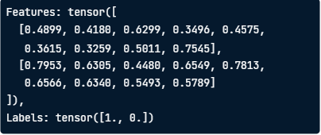
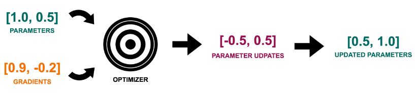

# Training Robust Neural Networks

## PyTorch and object-oriented programming
### Object-Oriented Programming(OOP)
* We will use OOP to define:
    * PyTorch Datasets
    * Pytorch Models
* In OOP, we create objects with:
    * Abilities (methods)
    * Data (attributes)

```python
class BankAccount:
    def __init__(self, balance):
        self.balance = balance
```
* `__init__` is called when `BankAccount` object is created
* `balance` is the attribute of the `BankAccount` object

```python
account = BankAccount(100)
print(account.balance)
```
-> `Output: 100`

* Methods: Python functions to perform tasks
* `deposit` method increases balance

```python
class BankAccount:
    def __init__(self, balance):
        self.balance = balance
    
    def deposit(self, amount):
        self.balance += amount

account = BankAccount(100)
account.deposit(50)
print(account.balance)
```
-> `Output: 150`

### PyTorch Dataset
```python
from torch.utils.data import Dataset

class WaterDataset(Dataset):
    def __init__(self, csv_path):
        super().__init__()
        df = pd.read_csv(csv_path)
        self.data = df.to_numpy()

    def __len__(self):
        return self.data.shape[0]
    
    def __getitem__(self, idx):
        features = self.data[idx, :-1]
        label = self.data[idx, -1]
        return features, label
```
* __init__: load data, store as numpy array

    * `super().__init__()` ensures `WaterDataset` bahaves like torch `Dataset`
* __len__: return the size of the dataset

* __getitem__:

    * take one argument called `idx`
    * return features and label for a single sample at index  `idx`

### PyTorch DataLader
```python
dataset_train = WaterDataset(
    "water_train.csv"
)
```
```python
from torch.utils.data import DataLoader

dataloader_train = DataLoader(
    dataset_train,
    batch_size=2,
    shuffle=True,
)
```
```python
features, label = next(iter(dataloader_train))
print(f"Features: {features},\nLabels: {labels}")
```


### PyTorch Model
Class-based model definition:
```python
class Net(nn.Module):
    def __init__(self):
        super(Net, self).__init__()
        self.fc1 = nn.Linear(9, 16)
        self.fc2 = nn.Linear(16, 8)
        self.fc3 = nn.Linear(8, 1)

    def forward(self, x):
        x = nn.functional.relu(self.fc1(x))
        x = nn.functional.relu(self.fc2(x))
        x = nn.functional.sigmoid(self.fc3(x))
        return x

net = Net()
```

## Optimizers, training, and evaluation
### Training loop
```python
import torch.nn as nn
import torch.optim as optim

criterion = nn.BCELoss()
optimizer = optim.SGD(net.parameters(), lr=0.01)

for epoch in range(1000):
    for features, labels in dataloader_train:
        optimizer.zero_grad()
        outputs = net(features)
        loss = criterion(
            outputs, labels.view(-1 , 1)
        )
        loss.backward()
        optimizer.step()
```
* Define loss function and optimizer

    * `BCDLoss` for binary classification
    * `SGD` optimizer
* Iterate over epochs and training batches
* Clear gradients
* Forward pass: get model's outputs
* Compute loss
* Compute gradients
* Optimizer's step: update params

### How an optimizer works


### Stochastic Gradient Descent (SGD)
```python
optimizer = optim.SGD(net.parameters(), lr=0.01)
```
* Update depends on learning rate
* Simple and efficient, for basic models

-> `Because of its simplicity, it's rarely used in practice.`

### Adaptive Gradient (Adagrad)
```python
optimizer = optim.Adagrad(net.parameters(), lr=0.01)
```
* Adapts learning rate for each parameter
* Good for sparse data
* May decrease the learning rate too fast

### Root Mean Square Prpagation (RMSprop)
```python
optimizer = optim.RMSprop(net.parameters(), lr=0.01)
```
* Update for each parameter based on the size of its previous gradients

### Adaptive Moment Estimation (Adam)
```python
optimizer = optim.Adam(net.parameters(), lr=0.01)
```
* Arguably the most versatile and widely used
* RMSprop + gradient momentum
* Often used as the go-to optimizer

### Model evaluation
```python
from torchmetrics import Accuracy

acc = Accuracy(task='binary')

net.eval()
with torch.no_grad():
    for features, labels in dataloader_test:
        outputs = net(features)
        preds = (outputs >= 0.5).float()
        acc(preds, labels.view(-1, 1))

accuracy = acc.compute()
print(f"Accuracy: {accuracy}")
```
* Set up accuracy metric
* 